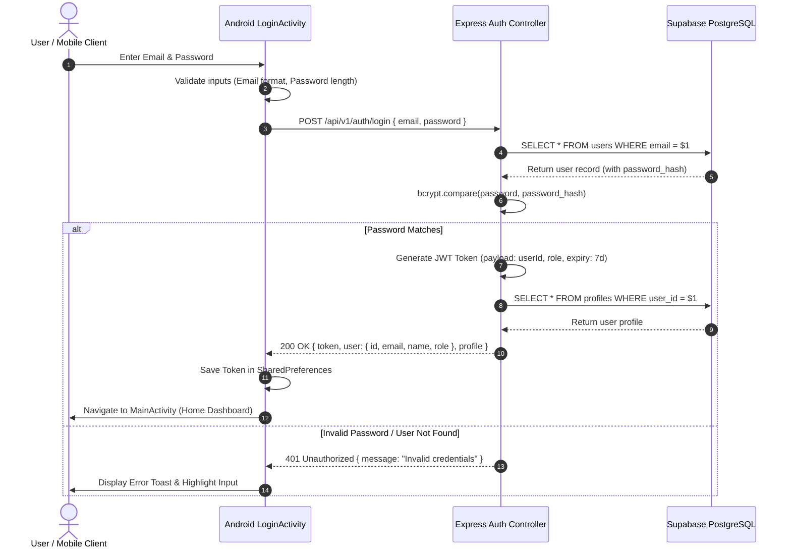
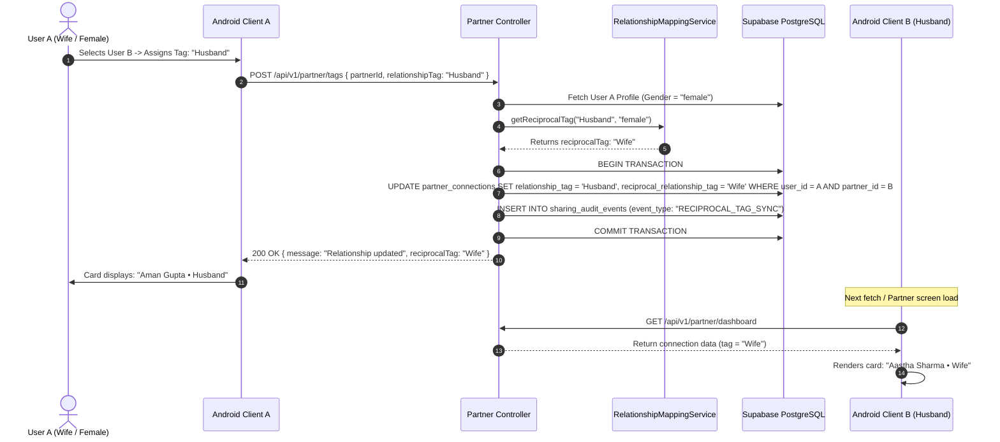
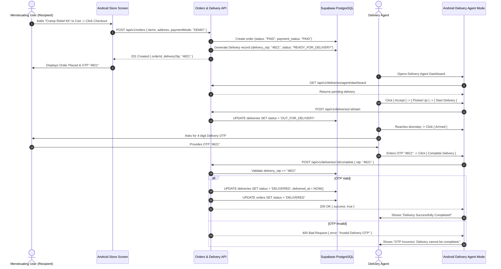

# CYCLECARE — COMPLETE TECHNICAL ARCHITECTURE
## Full-Stack Architecture, Data Flow, Sequence Diagrams & Industrial Design

---

## 1. HIGH-LEVEL MULTI-TIER SYSTEM ARCHITECTURE (सिस्टम आर्किटेक्चर)

CycleCare ko modern **5-Tier Enterprise Full-Stack Architecture** ke principles par design kiya gaya hai. Har layer ka responsibility scope strictly isolated hai, jisse system scalable, secure aur maintainable banta hai.

```mermaid
flowchart TD
    subgraph ClientLayer["1. CLIENT TIER (User & Delivery Interfaces)"]
        A1["Android Native App\n(Java + XML, MVVM)\nUsers & Partners"]
        A2["Android Delivery Mode\n(Courier Dashboard\n& OTP Verification)"]
        A3["Admin Web SPA\n(HTML5, CSS3, JS\nControl Panel)"]
    end

    subgraph NetworkLayer["2. SECURE NETWORK & API GATEWAY"]
        B1["HTTPS / SSL Termination"]
        B2["Retrofit 2.9 + OkHttp3\n(Bearer JWT Auth Interceptor\nAuto Retry & Timeout Handling)"]
    end

    subgraph ServerLayer["3. APPLICATION SERVER TIER (Node.js + Express)"]
        C1["Express Application Gateway\n(Helmet, CORS, Morgan, ErrorHandler)"]
        C2["Authentication & RBAC Engine\n(JWT Verification, Admin Guard)"]
        C3["Business Logic Controllers\n(Auth, Cycle, Partner, Orders, Delivery)"]
        C4["Domain & Mapping Services\n(RelationshipMappingService, PaymentProvider)"]
    end

    subgraph DataAccessLayer["4. DATABASE POOLER & DNS RESOLVER"]
        D1["PostgreSQL Connection Pool (pg.Pool)\n(Max 20 clients, SSL require)"]
        D2["Dual Custom DNS Resolver\n(Primary: 8.8.8.8 | Secondary: 1.1.1.1)\nIPv4 Supabase Host Resolution"]
    end

    subgraph StorageLayer["5. PERSISTENT CLOUD DATABASE (Supabase)"]
        E1[("Supabase PostgreSQL\n(Port 6543, Transaction Pooler)")]
        E2["Tables: users, profiles, period_logs, symptoms"]
        E3["Tables: partner_connections, partner_permissions, circle_messages"]
        E4["Tables: products, orders, deliveries, inventory_movements"]
        E5["Audit & Logs: sharing_audit_events, app_error_logs"]
    end

    ClientLayer --> NetworkLayer
    NetworkLayer --> ServerLayer
    ServerLayer --> DataAccessLayer
    DataAccessLayer --> StorageLayer
```

---

## 2. DETAILED TIER-BY-TIER BREAKDOWN (प्रत्येक लेयर का विवरण)

### Tier 1: Client Tier (Android Native & Admin Web)
1. **Android Client (`android/`):**
   - **Language & Runtime:** Pure Java 8+ compile target, running on Android OS 8.0 (API 26) through Android 14 (API 34).
   - **Architecture Pattern:** Model-View-ViewModel (MVVM) + Repository Pattern.
   - **UI Engine:** Android Native XML Layouts with Material Design Components 3, custom Neumorphic cards, gradient drawables, and Vector assets.
   - **State Management:** Android Architecture Components (`LiveData`, `ViewModel`, `LifecycleObserver`).
   - **Data Caching:** `SharedPreferences` for session tokens and user credentials; Room SQLite architecture for offline calendar log retention.
2. **Admin Web Dashboard (`backend/src/views/admin.html`):**
   - Single-Page Application (SPA) built using vanilla HTML5, CSS3, and JavaScript (Fetch API).
   - Zero heavyweight frontend framework dependency — ultra fast load time, instant rendering, and lightweight memory footprint.
   - Direct connection with `/api/v1/admin/*` and `/api/v1/monitoring/*` endpoints.

---

### Tier 2: Network & Communication Layer
- **Retrofit 2.9.0:** Type-safe REST client for Android jo standard Java interfaces ko asynchronous HTTP calls mein convert karta hai.
- **OkHttp 3.14.9:** Low-level HTTP engine with custom `Interceptor`:
  - `AuthInterceptor`: Har outgoing request ke header mein `Authorization: Bearer <jwt_token>` automatically inject karta hai.
  - `HttpLoggingInterceptor`: Debug builds mein network request/response headers aur body log karta hai.
  - Connection Pool with Keep-Alive: Repeated socket open/close overhead reduce karta hai.

---

### Tier 3: Application Server Tier (Node.js + Express)
- **Runtime:** Node.js v18.x / v20.x LTS.
- **Framework:** Express.js 4.18+.
- **Security Middlewares:**
  - `helmet()`: HTTP security headers inject karta hai (X-Content-Type-Options, X-Frame-Options, X-XSS-Protection).
  - `cors()`: Cross-Origin Resource Sharing control karta hai for Android clients aur Web admin panel.
  - Custom JWT verification middleware: User context (`req.user = { userId, email, role }`) har authenticated request par extract karta hai.
- **Modular Controller Architecture:**
  - `authController.js`: Registration, Login, Profile updates, Device token registration.
  - `cycleController.js`: Period logs, Symptom tracking, Prediction logic, Phase calculation.
  - `partnerController.js`: Partner invites, Reciprocal relationship sync, Granular permission management.
  - `chatController.js`: Real-time circle messages, Care pack gifting in chat.
  - `ordersController.js`: Cart checkout, Order creation, Order status transitions.
  - `deliveryController.js`: Delivery agent dashboard, Status progression, Live location simulation, OTP verification.
  - `monitoringController.js`: Real-time health metrics, Database latency, Memory utilization, Error logs.

---

### Tier 4: Database Connection Pooling & DNS Fallback
- **Supabase Pooler Resolution Problem:** Cloud environment aur Windows developer machines par aksar ISP ka local DNS Supabase pooler host (`aws-0-ap-southeast-2.pooler.supabase.com`) ko resolve karne mein fail ho jata hai (ENOTFOUND error).
- **Industrial Fallback Solution (`backend/src/config/db.js`):**
  - Node.js ke native `dns.setServers(['8.8.8.8', '1.1.1.1', '8.8.4.4'])` ka use karke Google aur Cloudflare ke globally reliable DNS servers ko primary resolver banaya gaya.
  - Agar connection pooler host name resolution fail hota hai, toh system gracefully error log karta hai aur retry pipeline initiate karta hai.
  - Connection Pool Configuration:
    - Max Clients: 20
    - Idle Timeout: 30,000 ms
    - Connection Timeout: 10,000 ms
    - SSL Configuration: `{ rejectUnauthorized: false }` for secure TLS tunnel.

---

### Tier 5: Persistent Storage Tier (Supabase PostgreSQL)
- High-performance relational database hosted on Supabase AWS Infrastructure.
- Fully normalized schema (3rd Normal Form) across 15+ relational tables.
- Foreign Key Constraints with `ON DELETE CASCADE` or `SET NULL` for referential integrity.
- Custom Check Constraints on enum-like values (e.g. `order_status IN ('PENDING', 'PAID', 'PACKED', 'OUT_FOR_DELIVERY', 'DELIVERED')`).
- Detailed audit trail table (`sharing_audit_events`) jo partner data access aur permission changes ko time-stamped log karta hai.

---

## 3. CORE SYSTEM SEQUENCE FLOWS (मुख्य सीक्वेन्स आरेख)

### Flow A: User Authentication & JWT Token Issuance

---

### Flow B: Automatic Reciprocal Relationship Tagging

---

### Flow C: Order Checkout, Live Courier Dispatch & OTP Handover

---

## 4. COURIER PRIVACY ISOLATION ARCHITECTURE (प्राइवेसी सुरक्षा)

CycleCare mein **Zero-Knowledge Courier Privacy** implement kiya gaya hai:

| Data Field | Recipient Android View | Partner Android View | Delivery Agent View | Reason for Restriction |
| :--- | :--- | :--- | :--- | :--- |
| **Recipient Name & Phone** | Full Visibility | Full Visibility | Full Visibility | Required for delivery contact. |
| **Delivery Address** | Full Visibility | Full Visibility | Full Visibility | Required for physical delivery. |
| **Package Item Count** | Full (3 Items) | Full (3 Items) | Masked Count ("1 Care Package") | Courier does not see sensitive product details. |
| **Period Phase & Days** | Full Visibility | Visible (if permitted) | **COMPLETELY HIDDEN (NULL)** | Zero relevance to delivery logistics. |
| **Symptoms & Mood Logs** | Full Visibility | Visible (if permitted) | **COMPLETELY HIDDEN (NULL)** | Medical privacy protection. |
| **Delivery OTP** | Visible ("4821") | Hidden | Input Field (Must match) | Prevents package theft and unauthorized handover. |

---

## 5. ARCHITECTURAL DECISIONS & DESIGN JUSTIFICATIONS (तकनीकी निर्णय)

1. **Why Native Java/XML instead of Flutter/React Native?**
   - Background services, battery-efficient `AlarmManager` scheduling, and custom smooth canvas animations (Panda mascot blinking/waving) require fine-grained control over Android hardware threads and native views.
2. **Why PostgreSQL on Supabase over MongoDB?**
   - Menstrual cycle history, order items, permissions, and reciprocal relationship mappings are inherently **relational and structured**. Relational foreign keys and ACID transactional integrity (e.g. order creation + inventory deduction + delivery generation in one transaction) prevent data corruption.
3. **Why Custom Dual DNS Fallback?**
   - Cloud platforms and domestic Wi-Fi routers frequently encounter DNS resolution throttling for external cloud poolers. Hardcoding reliable DNS resolvers directly in the Node.js process runtime eliminates runtime network downtime.
