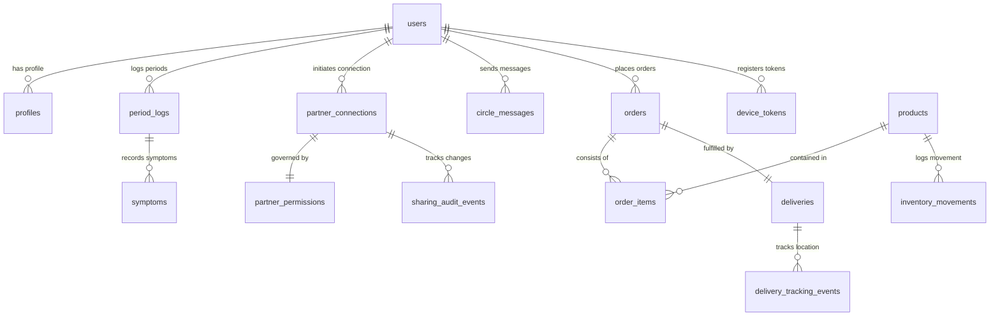

# CYCLECARE — DATABASE SCHEMA & DATA DICTIONARY
## Relational PostgreSQL Architecture, Supabase Migrations, Indexes & Data Dictionary

---

## 1. DATABASE ENVIRONMENT & CLOUD INFRASTRUCTURE (डेटाबेस इंफ्रास्ट्रक्चर)

CycleCare enterprise cloud relational database architecture par run hota hai:

- **Database Engine:** PostgreSQL 15.x
- **Cloud Provider:** Supabase Cloud Infrastructure (AWS Sydney `ap-southeast-2`)
- **Connection Pooler Host:** `aws-0-ap-southeast-2.pooler.supabase.com`
- **Port:** `6543` (PgBouncer Transaction Pooler) / `5432` (Direct Session)
- **Database Name:** `postgres`
- **Default Encoding:** `UTF-8`
- **Schema Management:** Sequential SQL Migrations (`database/migrations/001` through `006`)

---

## 2. ENTITY-RELATIONSHIP (ER) DIAGRAM

---

## 3. COMPREHENSIVE DATA DICTIONARY (विस्तृत डेटा डिक्शनरी)

### Table 1: `users` (मास्टर यूजर अकाउंट्स)
Stores core authentication accounts and access roles.

| Column Name | Data Type | Nullable | Default | Constraints / Index | Description |
| :--- | :--- | :--- | :--- | :--- | :--- |
| `id` | `UUID` | No | `gen_random_uuid()` | Primary Key | Unique user identification |
| `email` | `VARCHAR(255)` | No | None | Unique, Index | User login email address |
| `password_hash` | `VARCHAR(255)` | No | None | — | bcrypt hashed password |
| `full_name` | `VARCHAR(150)` | No | None | — | User's display name |
| `role` | `VARCHAR(50)` | No | `'user'` | Check: user, admin, delivery_agent | System permission role |
| `created_at` | `TIMESTAMPTZ` | No | `NOW()` | — | Account creation timestamp |
| `updated_at` | `TIMESTAMPTZ` | No | `NOW()` | — | Last modification timestamp |

---

### Table 2: `profiles` (यूजर प्रोफाइल और साइकल सेटिंग्स)
Extended user characteristics and physiological baseline parameters.

| Column Name | Data Type | Nullable | Default | Constraints / Index | Description |
| :--- | :--- | :--- | :--- | :--- | :--- |
| `id` | `UUID` | No | `gen_random_uuid()` | Primary Key | Profile record ID |
| `user_id` | `UUID` | No | None | FK -> `users(id)` ON DELETE CASCADE | Owning user identifier |
| `gender` | `VARCHAR(20)` | No | `'female'` | Check: female, male, other | Used for reciprocal tag rules |
| `age` | `INTEGER` | Yes | `NULL` | Check: age >= 10 | User age in years |
| `cycle_length` | `INTEGER` | No | `28` | Check: 20 to 45 | Average menstrual cycle days |
| `period_duration`| `INTEGER` | No | `5` | Check: 2 to 10 | Average bleeding duration days |
| `last_period_date`|`DATE` | Yes | `NULL` | — | Anchor date for phase calculations |
| `avatar_url` | `TEXT` | Yes | `NULL` | — | User profile picture URL |
| `theme_preference`|`VARCHAR(20)`| No | `'dark'` | Check: dark, light | Visual theme configuration |

---

### Table 3: `period_logs` (मासिक धर्म लॉग्स)
Historical logs of menstrual cycles entered by the user.

| Column Name | Data Type | Nullable | Default | Constraints / Index | Description |
| :--- | :--- | :--- | :--- | :--- | :--- |
| `id` | `UUID` | No | `gen_random_uuid()` | Primary Key | Period log ID |
| `user_id` | `UUID` | No | None | FK -> `users(id)` ON DELETE CASCADE | Owning user ID |
| `start_date` | `DATE` | No | None | Index | Bleeding commencement date |
| `end_date` | `DATE` | Yes | `NULL` | — | Bleeding conclusion date |
| `flow_intensity` | `VARCHAR(20)` | No | `'medium'` | Check: spotting, light, medium, heavy | Flow volume descriptor |
| `cramp_level` | `INTEGER` | No | `0` | Check: 0 to 5 | Pain scale (0 = None, 5 = Severe) |
| `notes` | `TEXT` | Yes | `NULL` | — | Personal private diary notes |
| `created_at` | `TIMESTAMPTZ` | No | `NOW()` | — | Record creation timestamp |

---

### Table 4: `partner_connections` (पार्टनर एवं पारिवारिक सम्बन्ध)
Bi-directional relationship connections between users and partners.

| Column Name | Data Type | Nullable | Default | Constraints / Index | Description |
| :--- | :--- | :--- | :--- | :--- | :--- |
| `id` | `UUID` | No | `gen_random_uuid()` | Primary Key | Connection ID |
| `user_id` | `UUID` | No | None | FK -> `users(id)` | Initiating user ID |
| `partner_id` | `UUID` | No | None | FK -> `users(id)` | Receiving partner user ID |
| `relationship_tag` | `VARCHAR(50)`| No | `'Partner'` | — | Tag assigned by `user_id` |
| `reciprocal_relationship_tag`|`VARCHAR(50)`| Yes | `NULL` | — | Auto-computed reciprocal tag |
| `status` | `VARCHAR(20)` | No | `'PENDING'`| Check: PENDING, ACCEPTED, REJECTED | Current connection status |
| `created_at` | `TIMESTAMPTZ` | No | `NOW()` | — | Invitation timestamp |
| `updated_at` | `TIMESTAMPTZ` | No | `NOW()` | — | Synchronization timestamp |

---

### Table 5: `partner_permissions` (ग्रेन्युलर शेयरिंग प्राइवेसी)
Security policy controlling exactly what cycle data the partner is authorized to see.

| Column Name | Data Type | Nullable | Default | Constraints / Index | Description |
| :--- | :--- | :--- | :--- | :--- | :--- |
| `id` | `UUID` | No | `gen_random_uuid()` | Primary Key | Permission policy ID |
| `connection_id`| `UUID` | No | None | FK -> `partner_connections(id)` | Owning connection ID |
| `share_phase` | `BOOLEAN` | No | `true` | — | Can partner view cycle phase? |
| `share_symptoms`| `BOOLEAN` | No | `false` | — | Can partner view symptoms/pain? |
| `share_predictions`|`BOOLEAN`| No | `true` | — | Can partner view next period date? |
| `share_mood` | `BOOLEAN` | No | `true` | — | Can partner view emotional state? |
| `updated_at` | `TIMESTAMPTZ` | No | `NOW()` | — | Last permission toggle timestamp |

---

### Table 6: `circle_messages` (सुरक्षित चैट संदेश)
Instant messages and care hamper cards exchanged in Circle Care Chat.

| Column Name | Data Type | Nullable | Default | Constraints / Index | Description |
| :--- | :--- | :--- | :--- | :--- | :--- |
| `id` | `UUID` | No | `gen_random_uuid()` | Primary Key | Message ID |
| `sender_id` | `UUID` | No | None | FK -> `users(id)` | Sender user ID |
| `recipient_id`| `UUID` | No | None | FK -> `users(id)` | Recipient user ID |
| `content` | `TEXT` | No | None | — | Message text or card payload |
| `message_type`| `VARCHAR(20)` | No | `'TEXT'` | Check: TEXT, CARE_ITEM, ALERT | Rendering layout type |
| `is_read` | `BOOLEAN` | No | `false` | Index | Message read confirmation |
| `created_at` | `TIMESTAMPTZ` | No | `NOW()` | Index | Message dispatch timestamp |

---

### Table 7: `sharing_audit_events` (ऑडिट एवं कम्प्लायंस ट्रेल्स)
Security audit log recording all relationship updates and permission changes.

| Column Name | Data Type | Nullable | Default | Constraints / Index | Description |
| :--- | :--- | :--- | :--- | :--- | :--- |
| `id` | `UUID` | No | `gen_random_uuid()` | Primary Key | Audit log event ID |
| `user_id` | `UUID` | No | None | FK -> `users(id)` | Actor user ID |
| `partner_id` | `UUID` | Yes | `NULL` | FK -> `users(id)` | Target partner ID |
| `event_type` | `VARCHAR(50)` | No | None | Index | e.g. `RECIPROCAL_TAG_SYNC` |
| `details` | `JSONB` | Yes | `NULL` | — | Old values, new values snapshot |
| `created_at` | `TIMESTAMPTZ` | No | `NOW()` | — | Exact audit timestamp |

---

### Table 8: `products` (वेलनेस स्टोर कैटलॉग)
E-commerce items available for purchase and gifting.

| Column Name | Data Type | Nullable | Default | Constraints / Index | Description |
| :--- | :--- | :--- | :--- | :--- | :--- |
| `id` | `VARCHAR(50)` | No | None | Primary Key | e.g. `p001-cramp-relief-patch` |
| `name` | `VARCHAR(200)`| No | None | Index | Product title |
| `category` | `VARCHAR(50)` | No | `'General'` | Index | Category filter |
| `price` | `NUMERIC(10,2)`| No | None | Check: price >= 0 | Price in INR (₹) |
| `stock_quantity`| `INTEGER` | No | `100` | Check: stock >= 0 | Available inventory |
| `image_url` | `TEXT` | Yes | `NULL` | — | Product asset URL |
| `description` | `TEXT` | Yes | `NULL` | — | Medical / usage details |

---

### Table 9: `orders` (ऑर्डर मास्टर रिकॉर्ड्स)
Orders placed by users or partners.

| Column Name | Data Type | Nullable | Default | Constraints / Index | Description |
| :--- | :--- | :--- | :--- | :--- | :--- |
| `id` | `UUID` | No | `gen_random_uuid()` | Primary Key | Internal order UUID |
| `order_number`| `VARCHAR(50)` | No | None | Unique, Index | e.g. `#CC-DEMO-1001` |
| `user_id` | `UUID` | No | None | FK -> `users(id)` | Placing customer ID |
| `total_amount`| `NUMERIC(10,2)`| No | None | — | Order grand total |
| `order_status`| `VARCHAR(30)` | No | `'PENDING'`| Check: PENDING, PAID, DELIVERED | Lifecycle status |
| `payment_status`|`VARCHAR(30)` | No | `'PENDING'`| Check: PENDING, PAID, FAILED | Payment confirmation |
| `delivery_address`|`TEXT` | No | None | — | Customer shipping address |
| `created_at` | `TIMESTAMPTZ` | No | `NOW()` | — | Order placement timestamp |

---

### Table 10: `deliveries` (एक्सप्रेस डिलीवरी लॉजिस्टिक्स)
Courier fulfillment tracking and OTP verification record.

| Column Name | Data Type | Nullable | Default | Constraints / Index | Description |
| :--- | :--- | :--- | :--- | :--- | :--- |
| `id` | `UUID` | No | `gen_random_uuid()` | Primary Key | Delivery record ID |
| `order_id` | `UUID` | No | None | FK -> `orders(id)` | Associated order ID |
| `courier_id` | `UUID` | Yes | `NULL` | FK -> `users(id)` | Assigned delivery agent |
| `delivery_status`|`VARCHAR(30)` | No | `'READY_FOR_DELIVERY'` | Check: ASSIGNED, DELIVERED | Delivery lifecycle |
| `delivery_otp`| `VARCHAR(10)` | No | `'4821'` | — | Secret 4-digit handover OTP |
| `eta_minutes` | `INTEGER` | No | `20` | — | Estimated delivery time |
| `progress_percent`|`INTEGER` | No | `0` | Check: 0 to 100 | Real-time transit percentage |
| `current_lat` | `NUMERIC(9,6)` | Yes | `18.5204` | — | Courier live latitude |
| `current_lng` | `NUMERIC(9,6)` | Yes | `73.8567` | — | Courier live longitude |
| `delivered_at`| `TIMESTAMPTZ` | Yes | `NULL` | — | Handover completion timestamp |

---

### Table 11: `app_error_logs` (सिस्टम एरर टेलीमेट्री)
Backend and mobile exception telemetry for real-time diagnostics.

| Column Name | Data Type | Nullable | Default | Constraints / Index | Description |
| :--- | :--- | :--- | :--- | :--- | :--- |
| `id` | `BIGSERIAL` | No | Generated | Primary Key | Error log entry sequence |
| `source` | `VARCHAR(50)` | No | `'BACKEND'` | — | Mobile app vs Backend server |
| `error_message`| `TEXT` | No | None | — | Exception summary |
| `stack_trace` | `TEXT` | Yes | `NULL` | — | Detailed runtime stack trace |
| `severity` | `VARCHAR(20)` | No | `'ERROR'` | Check: INFO, WARN, ERROR, FATAL | Diagnostic severity level |
| `created_at` | `TIMESTAMPTZ` | No | `NOW()` | Index | Occurrence timestamp |
