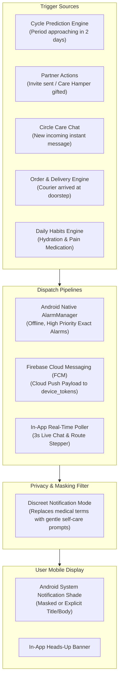

# CYCLECARE — NOTIFICATIONS & REAL-TIME FLOWS
## FCM Push Architecture, Local Alarm Schedules, Discreet Mode & Real-Time Sync

---

## 1. NOTIFICATION ARCHITECTURE OVERVIEW (नोटिफिकेशन आर्किटेक्चर)

CycleCare multi-layered notification system use karta hai jo online cloud push alerts aur offline device-level scheduled reminders dono ko seamlessly combine karta hai:



---

## 2. DISCREET NOTIFICATION MODE (डिस्क्रीट / प्राइवेसी मास्क मोड)

Public places, offices, college classrooms, ya family gatherings mein mobile screen par explicit medical terms pop up hone se awkwardness avoid karne ke liye CycleCare mein **Discreet Notification Mode** built-in hai:

| Event Type | Standard Mode Text | Discreet / Masked Mode Text |
| :--- | :--- | :--- |
| **Upcoming Period (2 Days)** | *"Menstrual period predicted in 2 days. Prepare sanitary pads."* | *"🌸 Gentle reminder: Time for some self-care and hydration!"* |
| **Ovulation Peak** | *"Peak fertility window today. Ovulation occurring."* | *"✨ Your energy peak is today! Have a wonderful day."* |
| **Partner Care Alert** | *"Your wife's period starts today. She may have severe cramps."* | *"❤️ Take extra care of your partner today — bring some chocolates!"* |
| **Care Hamper Gifted** | *"Aman sent you Cramp Relief Patches."* | *"🎁 Aman sent you a special CycleCare Comfort Pack!"* |
| **Courier Doorstep Arrival**| *"Courier arrived with Sanitary Care Kit. OTP is 4821."* | *"🚴 Your CycleCare package is at the door. OTP: 4821"* |

---

## 3. NOTIFICATION CHANNELS & LOCAL SCHEDULING (लोकल अलार्म शेड्यूलिंग)

Android 8.0 (API 26+) compliance ke liye application teen distinct notification channels maintain karti hai:

```java
public class NotificationHelper {
    public static final String CHANNEL_CYCLE_ALERTS = "channel_cycle_alerts";
    public static final String CHANNEL_PARTNER_CARE = "channel_partner_care";
    public static final String CHANNEL_DELIVERY_TRACKING = "channel_delivery_tracking";

    public static void createChannels(Context context) {
        if (Build.VERSION.SDK_INT >= Build.VERSION_CODES.O) {
            NotificationManager manager = context.getSystemService(NotificationManager.class);
            
            NotificationChannel cycleChannel = new NotificationChannel(
                CHANNEL_CYCLE_ALERTS,
                "Cycle & Health Reminders",
                NotificationManager.IMPORTANCE_HIGH
            );
            cycleChannel.setDescription("Upcoming period predictions and daily symptom logging reminders");
            
            NotificationChannel partnerChannel = new NotificationChannel(
                CHANNEL_PARTNER_CARE,
                "Partner & Family Care",
                NotificationManager.IMPORTANCE_HIGH
            );
            
            NotificationChannel deliveryChannel = new NotificationChannel(
                CHANNEL_DELIVERY_TRACKING,
                "Order & Delivery Updates",
                NotificationManager.IMPORTANCE_HIGH
            );

            manager.createNotificationChannel(cycleChannel);
            manager.createNotificationChannel(partnerChannel);
            manager.createNotificationChannel(deliveryChannel);
        }
    }
}
```

---

## 4. REAL-TIME DATA SYNCHRONIZATION PIPELINES (रियल-टाइम सिंक पाइपलाइन्स)

### 4.1 Circle Care Chat Real-Time Polling Engine
WebSocket deployment constraints aur mobile network drops ko handle karne ke liye CycleCare resilient **Smart Polling Architecture** use karta hai:
- Active Chat Activity open hone par `Handler` + `Runnable` schedule hota hai jo har **3000ms (3 seconds)** par `GET /api/v1/chat/messages/:partnerId?after=<lastTimestamp>` request karta hai.
- Agar user chat screen se bahar navigate karta hai (`onPause()` / `onStop()`), polling loop immediately cancel ho jata hai, jisse zero background battery drain ensure hoti hai.

### 4.2 Courier Live Route & ETA Simulation
- Delivery Agent jab `[ Simulate Movement ]` trigger karta hai, backend `/api/v1/deliveries/:id/simulate` route coordinates (`currentLat`, `currentLng`, `progressPercent`, `etaMinutes`) ko incremental updates deta hai.
- Customer ki `OrderTrackingActivity` screen har 4 seconds par update fetch karke visual delivery marker ko map route par aage move karti hai aur countdown ETA update karti hai.

### 4.3 Database Token Registration (`device_tokens`)
Jab bhi user login karta hai, uska FCM Device Token backend table `device_tokens` mein save ya update hota hai:
- Columns: `user_id`, `token`, `device_type` (`android`), `updated_at`.
- Multi-device login support: Agar ek user tablet aur phone dono use kar raha hai, dono devices ko simultaneously alerts dispatch hote hain.
