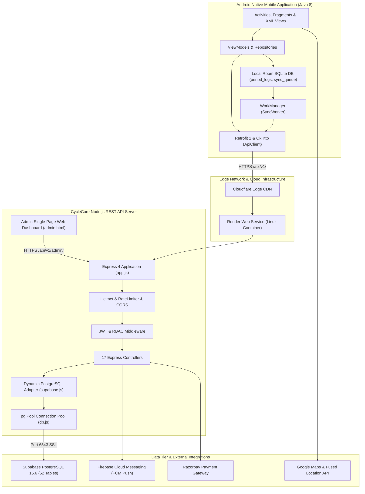
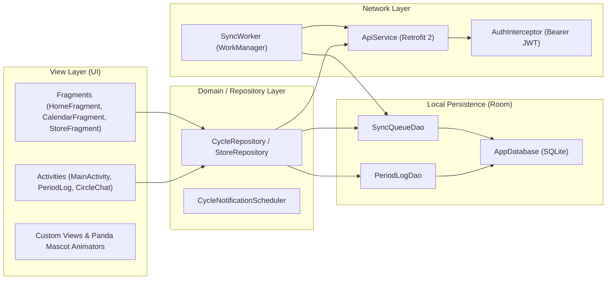
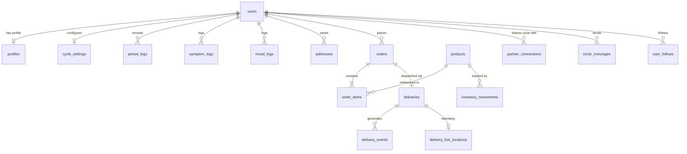
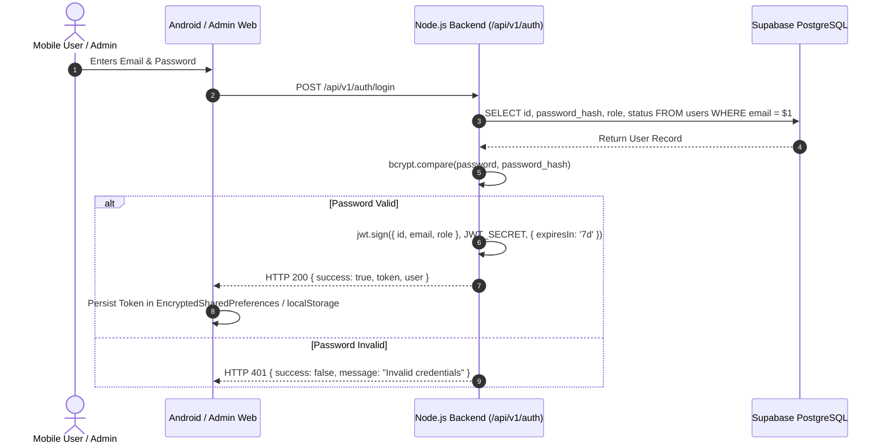
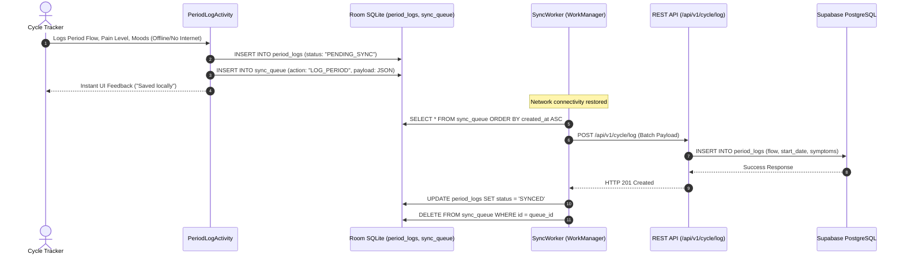

# 03_SYSTEM_ARCHITECTURE.md — System Architecture & Component Design

**Scope:** Architectural blueprint of CycleCare covering client-server topology, component interactions, database models, authentication workflows, and deployment infrastructure.  
**Audit Date:** 2026-10-10  
**Verification Method:** Static call graph analysis, Android Manifest inspection, Express router mapping, and live database query tracing.

---

## 1. High-Level System Architecture



---

## 2. Android Client Component Architecture (MVVM)



---

## 3. Backend Module & Router Architecture

The backend implements a modular, decoupled Express REST design:

```
src/
├── app.js                          # Core Express initialization & route registry
├── server.js                       # HTTP listener binding on process.env.PORT
├── config/
│   ├── db.js                       # Authoritative pg.Pool direct connection
│   ├── supabase.js                 # Query adapter providing .from().select() syntax
│   └── razorpay.js                 # Razorpay client instance
├── middleware/
│   ├── auth.js                     # authenticateToken JWT verification
│   ├── rbac.js                     # authorizeRoles('USER', 'ADMIN', 'SUPER_ADMIN')
│   └── errorHandler.js             # Formats errors into { success: false, message, code }
├── controllers/                    # 17 Feature Controllers
│   ├── authController.js           # Signup, Login, Demo Auth, Password Reset
│   ├── cycleController.js          # Period Logging, Cycles, Predictions
│   ├── chatController.js           # Trusted Circle WhatsApp-style Messaging & Tags
│   ├── deliveryController.js       # Courier Dispatch, Simulation, OTP Handoff
│   ├── adminController.js          # Raw SQL Analytics, User Tags, Chat Monitoring
│   ├── ordersController.js         # Checkout, Order Lifecycle, Recipient Tracking
│   ├── paymentsController.js       # Razorpay & DemoPaymentProvider
│   └── ... (10 additional controllers)
├── routes/                         # 17 Express Router Modules (mounted at /api/v1/*)
├── services/
│   ├── cycleService.js             # Ovulation and Phase Prediction Calculation
│   ├── notificationService.js      # Firebase Cloud Messaging Delivery
│   ├── paymentProvider.js          # Abstract & Concrete Demo Payment Engine
│   └── paymentService.js           # Razorpay Signature Verification
└── views/
    └── admin.html                  # Single-Page Admin Web Panel
```

---

## 4. Database Relationship Topology (Core Entities)



---

## 5. End-to-End Authentication Workflow



---

## 6. End-to-End Delivery & 4-Digit OTP Handoff Workflow

```mermaid
sequenceDiagram
    autonumber
    actor Customer as CycleCare Customer
    participant AndroidCustomer as Customer App (OrderTrackingActivity)
    participant Backend as Express Backend
    participant DB as PostgreSQL
    participant CourierApp as Courier App (DeliveryAgentActivity)
    actor Courier as Delivery Courier

    Customer->>Backend: Complete Checkout (#CC-DEMO-1001)
    Backend->>DB: INSERT INTO orders & deliveries (delivery_otp = '4821')
    Backend-->>AndroidCustomer: Displays "Delivery OTP: 4821" (Confidential to Recipient)
    
    Courier->>CourierApp: Opens Delivery Agent Dashboard
    CourierApp->>Backend: POST /api/v1/deliveries/:id/accept
    CourierApp->>Backend: POST /api/v1/deliveries/:id/start
    CourierApp->>Backend: POST /api/v1/deliveries/:id/simulate (Step 25% -> 50% -> 90%)
    Backend->>AndroidCustomer: Live Map updates courier marker & ETA (~15 mins)
    
    CourierApp->>Backend: POST /api/v1/deliveries/:id/arrived
    Courier->>Customer: Courier arrives at doorstep, asks for OTP
    Customer->>Courier: Recipient shares verbal OTP "4821"
    Courier->>CourierApp: Inputs "4821" in Complete Delivery Dialog
    CourierApp->>Backend: POST /api/v1/deliveries/:id/complete { delivery_otp: "4821" }
    Backend->>DB: Verify delivery_otp == '4821'; Update order & delivery status to DELIVERED
    Backend-->>CourierApp: HTTP 200 { success: true, message: "Delivered successfully" }
    Backend-->>AndroidCustomer: Order marked DELIVERED; Timeline completed
```

---

## 7. Offline-First Cycle Data Synchronization Flow


