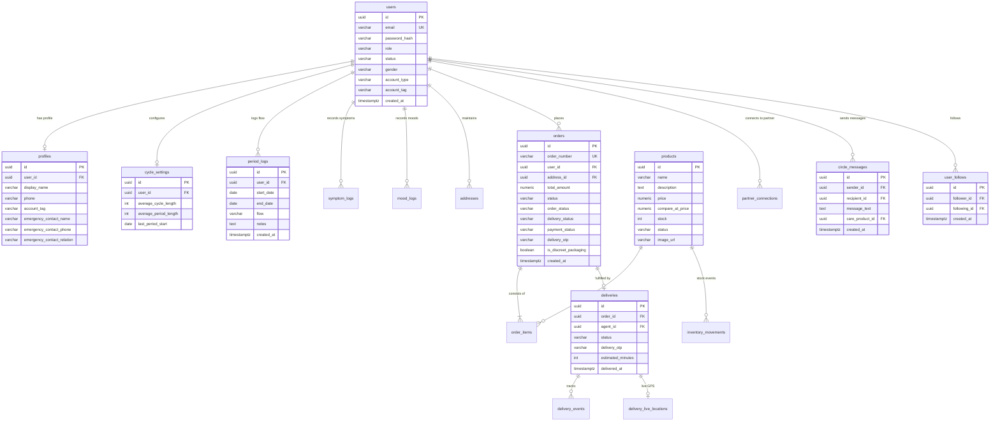

# 07_DATABASE_SCHEMA_AND_RELATIONSHIPS.md — Database Schema and Entity Relationships

**Scope:** Complete forensic documentation of the 52 PostgreSQL relational tables, foreign keys, unique constraints, check conditions, indexes, triggers, and Row Level Security (RLS) policies in CycleCare.  
**Audit Date:** 2026-10-10  
**Host Platform:** Supabase PostgreSQL 15.6 (`aws-0-ap-southeast-2.pooler.supabase.com:6543`)  
**Evidence Standard:** SQL Migrations 001 through 008 (`database/migrations/*.sql`) and direct PostgreSQL catalog queries.

---

## 1. Entity-Relationship Diagram (Core Subsystems)

---

## 2. Table-by-Table Technical Catalog

### 2.1 Core Identity & Profile Tables
#### 1. `users`
- **Purpose:** Primary authentication entity storing login credentials and role permissions.
- **Columns:**
  - `id` (`UUID`, Primary Key, `gen_random_uuid()`)
  - `email` (`VARCHAR(255)`, Unique, Not Null)
  - `password_hash` (`VARCHAR(255)`, Not Null, bcrypt hash)
  - `role` (`VARCHAR(50)`, Default: `'USER'`, Values: `'USER'`, `'ADMIN'`, `'SUPER_ADMIN'`)
  - `status` (`VARCHAR(50)`, Default: `'ACTIVE'`, Values: `'ACTIVE'`, `'SUSPENDED'`, `'PENDING'`)
  - `gender` (`VARCHAR(20)`, Default: `'FEMALE'`, Values: `'FEMALE'`, `'MALE'`, `'OTHER'`)
  - `account_type` (`VARCHAR(20)`, Default: `'REAL'`, Values: `'REAL'`, `'DEMO'`)
  - `account_tag` (`VARCHAR(100)`, Default: `'REAL USER'`)
  - `usage_mode` (`VARCHAR(50)`, Default: `'TRACK_CYCLE'`)
  - `created_at`, `updated_at` (`TIMESTAMPTZ`, Default: `NOW()`)
- **Indexes:** Unique on `email`, index on `role`, index on `account_type`.

#### 2. `profiles`
- **Purpose:** User biographical details, emergency contacts, and customizable tags.
- **Columns:**
  - `id` (`UUID`, Primary Key)
  - `user_id` (`UUID`, Foreign Key references `users(id)` ON DELETE CASCADE, Unique)
  - `display_name` (`VARCHAR(255)`)
  - `phone` (`VARCHAR(20)`)
  - `account_tag` (`VARCHAR(100)`, Default: `'REAL USER'`)
  - `emergency_contact_name` (`VARCHAR(100)`)
  - `emergency_contact_phone` (`VARCHAR(20)`)
  - `emergency_contact_relation` (`VARCHAR(50)`)
  - `bio` (`TEXT`)
  - `avatar_url` (`TEXT`)
  - `created_at`, `updated_at` (`TIMESTAMPTZ`)

---

### 2.2 Menstrual Cycle & Biomarker Tables
#### 3. `cycle_settings`
- **Columns:** `id`, `user_id` (FK `users`), `average_cycle_length` (Default: 28), `average_period_length` (Default: 5), `last_period_start` (`DATE`), `created_at`, `updated_at`.
#### 4. `period_logs`
- **Columns:** `id`, `user_id` (FK `users`), `start_date` (`DATE`, Not Null), `end_date` (`DATE`), `flow` (`VARCHAR(50)`: `'Spotting'`, `'Light'`, `'Medium'`, `'Heavy'`), `notes` (`TEXT`), `created_at`.
- **Note on Column Name:** Authoritative column name is `flow` (formerly referenced in legacy drafts as `flow_intensity`).
#### 5. `symptoms` & `symptom_logs`
- **Taxonomy:** Cramps, Headache, Bloating, Acne, Fatigue, Nausea, Backache.
- **Log Columns:** `id`, `user_id`, `symptom_id`, `severity` (1-5), `log_date` (`DATE`), `created_at`.
#### 6. `moods` & `mood_logs`
- **Taxonomy:** Calm, Happy, Energetic, Irritable, Anxious, Sad, Mood Swings.
- **Log Columns:** `id`, `user_id`, `mood_id`, `intensity` (1-5), `log_date` (`DATE`), `created_at`.
#### 7. `reminders`
- **Columns:** `id`, `user_id`, `type`, `time` (`TIME`, e.g. `09:00:00`), `is_enabled` (`BOOLEAN`), `custom_title`, `created_at`.

---

### 2.3 Store Catalog, Cart & Orders Tables
#### 8. `categories`
- **Columns:** `id`, `name`, `slug` (Unique), `description`, `icon_url`, `created_at`.
#### 9. `products`
- **Columns:**
  - `id` (`UUID`, Primary Key)
  - `category_id` (`UUID`, FK `categories(id)`)
  - `name` (`VARCHAR(255)`, Not Null)
  - `slug` (`VARCHAR(255)`, Unique)
  - `description` (`TEXT`)
  - `price` (`NUMERIC(10,2)`, Not Null)
  - `compare_at_price` (`NUMERIC(10,2)`)
  - `stock` (`INT`, Default: 0)
  - `low_stock_threshold` (`INT`, Default: 5)
  - `status` (`VARCHAR(50)`, Default: `'LIVE'`, Values: `'DRAFT'`, `'LIVE'`, `'ARCHIVED'`)
  - `image_url` (`TEXT`)
  - `created_at`, `updated_at` (`TIMESTAMPTZ`)
#### 10. `inventory_movements`
- **Columns:** `id`, `product_id` (FK `products`), `quantity` (`INT`), `movement_type` (`VARCHAR(50)`: `'ADD'`, `'REMOVE'`, `'PURCHASE'`, `'ADJUSTMENT'`, `'REFUND'`, `'CANCELLATION'`), `notes` (`TEXT`), `actor_id` (`UUID`, FK `users(id)`, Nullable), `created_at`.
#### 11. `addresses`
- **Columns:** `id`, `user_id` (FK `users`), `address_line` (`TEXT`), `city` (`VARCHAR(100)`), `state` (`VARCHAR(100)`), `pincode` (`VARCHAR(20)`), `phone` (`VARCHAR(20)`), `latitude` (`NUMERIC(10,7)`), `longitude` (`NUMERIC(10,7)`), `is_default` (`BOOLEAN`).
- **Note on Column Schema:** Uses `address_line` and `pincode` (NOT `street` or `postal_code`).
#### 12. `orders`
- **Columns:**
  - `id` (`UUID`, Primary Key)
  - `order_number` (`VARCHAR(50)`, Unique)
  - `user_id` (`UUID`, FK `users(id)`)
  - `address_id` (`UUID`, FK `addresses(id)`, Nullable)
  - `subtotal`, `discount`, `delivery_fee`, `total_amount` (`NUMERIC(10,2)`)
  - `status` (`VARCHAR(50)`, Default: `'PENDING'`)
  - `order_status` (`VARCHAR(50)`, Default: `'PENDING'`)
  - `delivery_status` (`VARCHAR(50)`, Default: `'PENDING'`)
  - `payment_status` (`VARCHAR(50)`, Default: `'PENDING'`)
  - `delivery_otp` (`VARCHAR(10)`, Default: `'4821'`)
  - `is_discreet_packaging` (`BOOLEAN`, Default: `true`)
  - `order_type` (`VARCHAR(20)`, Default: `'REAL'`, Values: `'REAL'`, `'DEMO'`)
  - `created_at`, `updated_at` (`TIMESTAMPTZ`)
#### 13. `order_items`
- **Columns:** `id`, `order_id` (FK `orders`), `product_id` (FK `products`), `product_name_snapshot` (`VARCHAR(255)`), `unit_price` (`NUMERIC(10,2)`), `quantity` (`INT`), `total` (`NUMERIC(10,2)`).

---

### 2.4 Delivery Agent & Telemetry Tables
#### 14. `deliveries`
- **Columns:** `id`, `order_id` (FK `orders`), `agent_id` (`UUID`, FK `users(id)`), `status` (`VARCHAR(50)`: `'READY_FOR_DELIVERY'`, `'ACCEPTED'`, `'PICKED_UP'`, `'OUT_FOR_DELIVERY'`, `'ARRIVED_AT_DOORSTEP'`, `'DELIVERED'`), `delivery_otp` (`VARCHAR(10)`), `progress_percent` (`INT`, Default: 0), `eta_minutes` (`INT`), `pickup_at`, `delivered_at`, `created_at`.
#### 15. `delivery_live_locations`
- **Columns:** `id`, `delivery_id` (FK `deliveries`), `latitude` (`NUMERIC(10,7)`), `longitude` (`NUMERIC(10,7)`), `progress_percent` (`INT`), `eta_minutes` (`INT`), `updated_at`.
#### 16. `delivery_events`
- **Columns:** `id`, `delivery_id` (FK `deliveries`), `event_type` (`VARCHAR(50)`), `description` (`TEXT`), `timestamp` (`TIMESTAMPTZ`).

---

### 2.5 Social, Trusted Circle & Follow Tables
#### 17. `circle_messages`
- **Columns:**
  - `id` (`UUID`, Primary Key)
  - `sender_id` (`UUID`, FK `users(id)`, Not Null)
  - `recipient_id` (`UUID`, FK `users(id)`, Not Null)
  - `message_text` (`TEXT`)
  - `care_product_id` (`UUID`, FK `products(id)`, Nullable)
  - `care_product_name` (`VARCHAR(255)`, Nullable)
  - `care_product_price` (`NUMERIC(10,2)`, Nullable)
  - `care_product_image` (`TEXT`, Nullable)
  - `is_read` (`BOOLEAN`, Default: `false`)
  - `created_at` (`TIMESTAMPTZ`, Default: `NOW()`)
#### 18. `user_follows`
- **Columns:** `id`, `follower_id` (`UUID`, FK `users(id)`), `following_id` (`UUID`, FK `users(id)`), `created_at`. Unique constraint on `(follower_id, following_id)`.
#### 19. `partner_connections`
- **Columns:** `id`, `user_id` (FK `users`), `partner_id` (FK `users`), `status` (`VARCHAR(50)`: `'PENDING'`, `'ACTIVE'`, `'BLOCKED'`), `invite_code` (`VARCHAR(20)`), `created_at`.
#### 20. `partner_permissions`
- **Columns:** `id`, `connection_id` (FK `partner_connections`), `can_view_cycle` (`BOOLEAN`), `can_view_moods` (`BOOLEAN`), `can_send_gifts` (`BOOLEAN`), `updated_at`.

---

## 3. Database Triggers & Functions
1. `update_updated_at_column()`: PL/pgSQL function triggered `BEFORE UPDATE` on `users`, `profiles`, `products`, `orders`, and `cycle_settings` to automatically set `updated_at = NOW()`.
2. `audit_log_trigger()`: Records insertions and updates into `audit_logs` table for tracking administrative changes.
